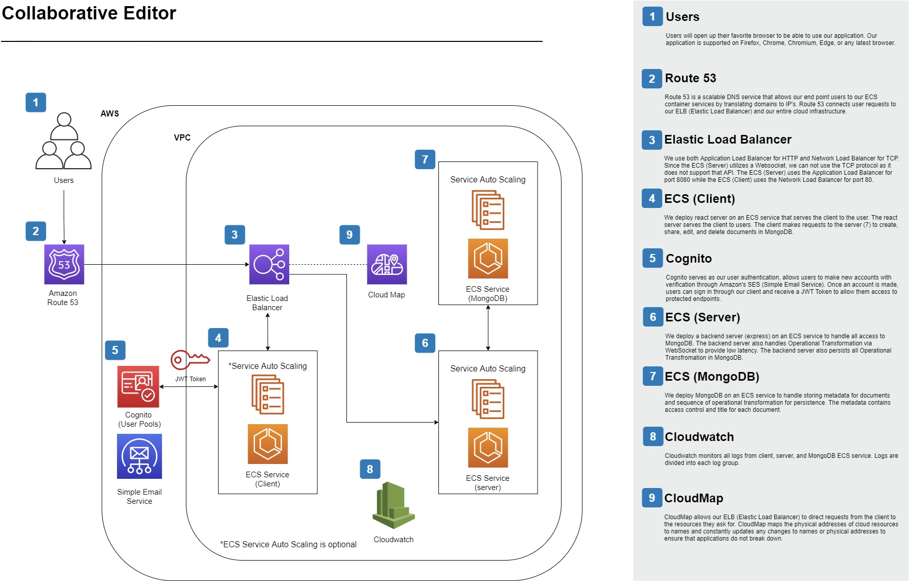

# Documents on Cloud 

## Project Goal and Purpose
The goal of this project was to create a collaborative editor similar to services like Overleaf and Google Docs. The project focuses on two core functionalities:

1. Allowing multiple users to edit the same document simultaneously.
2. Enabling users to create, delete, share, and edit documents collaboratively.

An additional objective was to include common text editing features such as text highlighting, text alignment, and various font styles and sizes, ensuring an elegant, reliable, and cost-effective solution.

## Dependencies
- **React**
- **Quill**
- **Material-UI**
- **Express.js**
- **ShareDB**
- **MongoDB**

## Project Description
The system integrates advanced cloud technologies and automation to deliver a robust collaborative editing platform. It supports scalable infrastructure with health checks and auto-scaling capabilities on AWS ECS. The architecture ensures optimal performance and resilience.

### Front End
The front-end client, built with React, employs Material-UI for the user interface and Quill for the WYSIWYG editor. Key features include:
- Document creation, editing, sharing, and deletion
- Real-time collaborative editing

### Back End
The back-end server, implemented using Express.js, handles requests and integrates with MongoDB. ShareDB enables real-time collaboration through [Operational Transformation (OT)](https://en.wikipedia.org/wiki/Operational_transformation). Communication is facilitated using WebSocket for low-latency operations.

### MongoDB
MongoDB stores document metadata and operational transformations. Metadata includes titles and access control, ensuring secure and organized data management.

## System Architecture on AWS

The system is deployed using Docker Compose, ECS, and AWS CloudFormation. Client and server services are hosted in an auto-scaling ECS cluster, which dynamically adjusts to user demand. This ensures robust performance for simultaneous multi-user collaboration.

## Deployment
The system supports:
- Local deployment using Docker Compose
- Cloud deployment on AWS ECS with scaling capabilities

For detailed setup and deployment instructions, refer to:
- [BUILD.md](BUILD.md) for environment setup
- [INSTALL.md](INSTALL.md) for deployment guidelines

## Future Work
- **Migration to AWS DocumentDB**: Transitioning from MongoDB to AWS DocumentDB will enhance scalability and integration within AWS services.
- **UI/UX Enhancements**: Proposed improvements include:
  - Autofill suggestions for user emails when sharing documents
  - Document grouping for better organization

## Relevance to Job Description
This project aligns with the responsibilities outlined in the Senior Cloud System Developer role (Job Ref# SCSD3) at Cloudreach, Inc. It demonstrates:
- Delivery of technical solutions using cutting-edge technologies
- Use of automation for scalable and cost-effective solutions
- Expertise in DevOps tools such as Terraform, Python, Bash, and Ansible
- Deployment and configuration of cloud-based infrastructure

## References
- [React AWS Cognito Example](https://github.com/patmood/react-aws-cognito-example)
